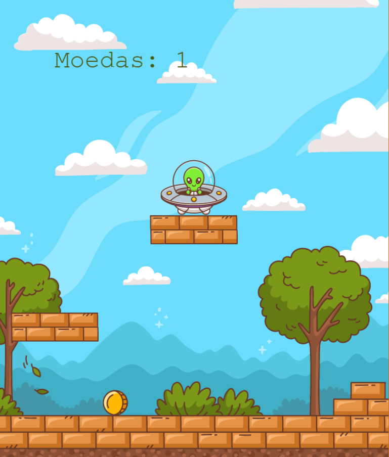

# Alien Coin Collector

Este projeto é um jogo interativo desenvolvido com a framework **Phaser.js**, criado para aprimorar minhas habilidades em JavaScript. O objetivo do jogo é controlar um alienígena que coleta moedas enquanto se move por plataformas, garantindo uma experiência divertida e dinâmica.

## 🛠️ Tecnologias Utilizadas

- **JavaScript**: A linguagem de programação principal utilizada no desenvolvimento do jogo.
- **Phaser.js**: Framework para desenvolvimento de jogos em 2D, que facilita a criação de animações e interações.

## 📸 Screenshots

  

## 🚀 Funcionalidades

- **Movimento do Alien**: O alienígena pode se mover para a esquerda, direita e saltar para coletar moedas.
- **Colecionar Moedas**: Ao coletar uma moeda, o placar é atualizado e a moeda reaparece em uma nova posição.
- **Fogo Turbo**: Quando o jogador pressiona a tecla de salto, um efeito visual de fogo é ativado na nave do alien.
- **Plataformas**: O jogo contém plataformas estáticas nas quais o alien pode interagir e coletar moedas.

## 📝 Aprendizados

- **Fundamentos do Phaser.js**: Aprendi a configurar um projeto básico de jogo, incluindo a manipulação de sprites e colisões.
- **Movimentação e Física**: Melhorei minhas habilidades em programar movimentação de personagens e implementar a física do jogo.
- **Gerenciamento de Placar**: Aprendi a implementar um sistema de placar que atualiza dinamicamente à medida que o jogador coleta moedas.

